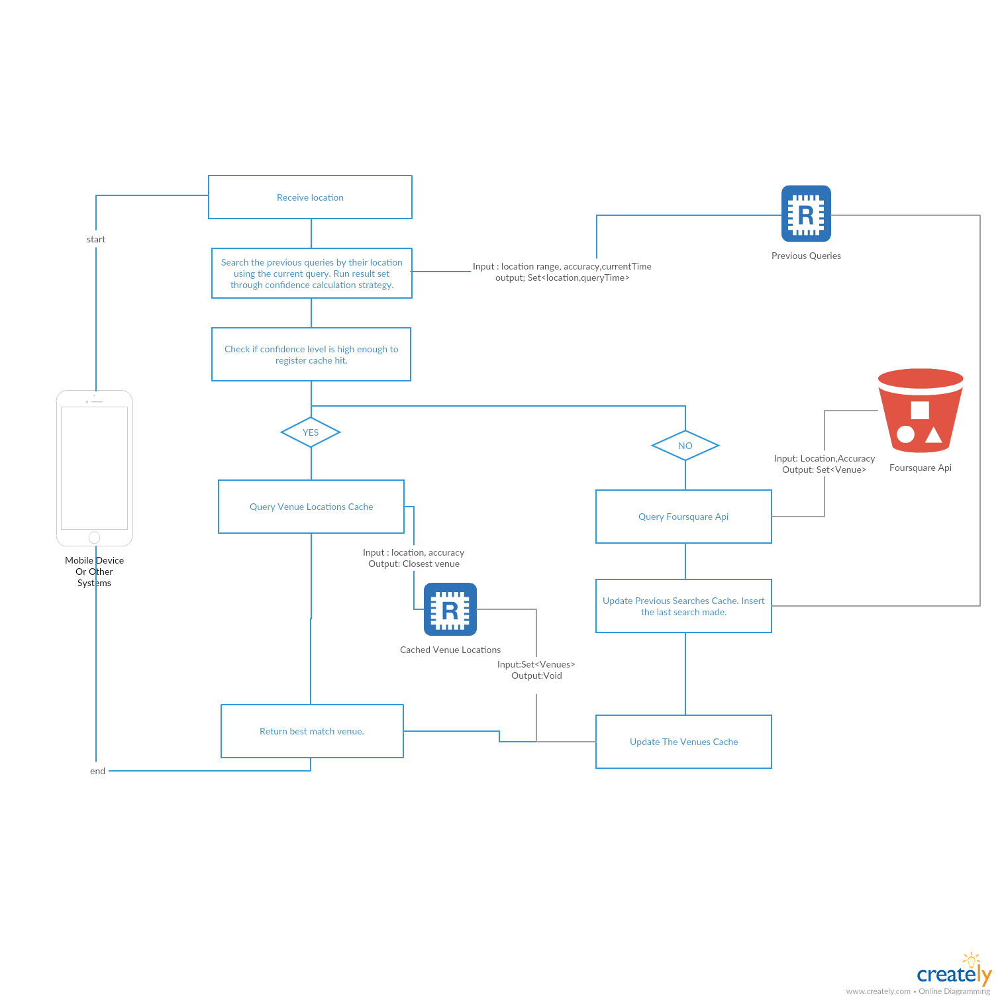

# PART 1

## Tools/Libraries
* Build tool is gradle.
* Test framework is junit.
* Command line parsing library is JCommander.
* No DI framework used since this is an assignment and little code. In production I would make use of a DI framework.
* I used Gson for serialisation of metadata.

## Assumptions
* Non existing directories should be created upon need without user intervention.
* Multiple create master data set requests to the same directory is a user error.
* An update can give a folder name that is not present in master data set. It will be processed as if there were such a folder with 0 size.
* I do not support any manual data addition from user. Such operation would require metadata update to be consistent.
* Non empty master data set directory is a user error when creating new master data set. (Because; in case of an update, files that are not part of master data set yet inside the directory can be appended and corrupted. This can still happen if the user puts folders in master data set after it is created. That is user error.)  
* File encoding is not configurable. I used UTF-8. My code also knows how to calculate UTF-8 file size only. Code is extensible though. 
* Length of each line is irrelevant. Keeping them of cosntant legnth is ok.
* Filenames are irrelevant.
* I can put metadata in to the master data set directory. 
* Standard file system is used in implementation but simple refactor will enable the use of network file systems. Relevant abstractions are made in code. Design discussion avoids this assumption.
* Storage medium allows multiple appenders.
* Tester has unix like environment.

## Usage

I put helper shell scripts on top level directory. You can of course prefer to run commands inside those scripts directly.

To generate a master data set run; 
```zsh
./generateMasterDataSet.sh <master-data-set-directory> -size <file-size-in-mb> -data <folder-name-1>,<folder-size-1>,...,<folder-size-n>,<folder-name-n>
```

To update a master data set run; 
```zsh
./updateMasterDataSet.sh <master-data-set-directory> <file-size-in-mb> <folder-name-1>,<folder-size-1>,...,<folder-size-n>,<folder-name-n>
```

 


## Design Decisions
#### Use of Independent SubTasks
**rationale:** The idea to single threadedly populate a folder is not scalable to the big data sizes in cases which the storage medium is not the bottleneck. This case commonly arises when the storage medium is a highly scalable service. Thus the operation to populate a folder should be divided into independent sub tasks. Subtask could be defined by the state each target file but without loss of generality this task can be defined only by the incremental operation on the file. This level of generality will allow simultaneous tasks to be executed on the same file.

A file append task is defined for this purpose. The file appender task does not assume the existence of the given file. It is generalized to the point that it only knows a file location, the amount of data to write, a file encoding, a file size calculation mechanism and a data supplier.

#### Use of Shared Metadata
**rationale:** It is possible that for any given time there are ongoing data generation or data update tasks being executed for the given master data set. Thus the current size of the files can not be used to determine the state of a folder or master data set.

A minimal metadata is defined and persisted to root directory. 
  
#### Precalculation of Datasize
**rationale:** It is possible to query the file system to monitor file size. That would not work in this case because there may be multiple appenders writing to the same file simultaneously. Querying file system for data size change on a file does cannot reveal how much of the additional data is written by each task. Also that will be an extra hit on the filesystem that is possibly the bottleneck.

To overcome this limitation each file appender task keeps track of the amount of data it has written. Thus the file encoding must be known by the file appender.
   
## Limitations/Things to Be Improved

1. The operation to write to the file is not idempotent. Any failure that left task incomplete can not repair itself on retry. Since there may be data already written on file during the failed execution a task that that only knows how much more data to write to each file will overflow data on retry.
There is not retry mechanism implemented in the assignment but there are multiple ways to overcome this issue;
    * Each file can be locked before executing a file append task. So that multiple append tasks are not executed on same file. The task should also read and atomically persist the finishing size of the file before starting the task. This will make the task idempotent with cost of scalability. Loss of scalability is reasonable in most use cases. The size of each file is subject to configuration. Total data size can still grow to multiple files anyway.
    * There can be a check and repair task that executes when no other writing task is executed on a master data set. This task can receive the latest registered state of the master data set and queue new data update tasks. 
  
2. It is not good to store metadata in hidden files. It should be persisted on proper DBs. Both SQL and NoSql dbs can be used. Also there is not much of a scalability concern. Metadata can be quite small.

3. Depending on the type of storage medium too high level of parallelism may be deficient for final throughput on storage. Optimisations can be applied by the storage medium.

4. The metadata can be enriched to keep complete history of updates together with the final status. 

5. I would keep a lot more data to monitor/stop/restart/recover status of each task at all times.

6. If requirements are extended for ability to return to a specific state. Simple byte offste checkpointing can be implemented. 

7. In memory producer/queue/consumer/storage mechanism is implemented. All queue and consumer mechanism can be externalized for enforced modularity instead of soft modularity.

8. Metadata should be atomically written and read with a lock mechanism. Metadata is locked briefly while the new state of the master data set is calculated. Thus there is almost no performance hit. This issue is gone if a proper ACID db is used.


### 1.1 Data Generation

####1.1.1 Design Decisions
    * Master Dataset Creator is composed of validation, master dataset directory creation and delegation of file creation tasks to data update tool.
    * Random generation is done by a ThreadLocalRandom generator as it is more performant than both Random and SecureRandom generators.
###1.2 Data Update


####1.2.2 Design Decisions
    
    I made use of shared metadata in order to determine the last registered file sizes.
    * The final number of files and their sizes are precalculated in order to be able to create well defined tasks that can execute independently for each file.
    * The granularity of file append tasks can be further reduced depending in the performance needs.
    
# PART 2

### Data Refresh System

I propose a caching layer in front of foursquare api. This caching layer will update from foursquare api whenever there is a cold miss on the cache. The caching layer has to be a best effort since it has no way of knowing a new venue has been added to the foursquare api or one is removed.

Cache layer will hold 2 kinds of geospatial data. One of them holds the records of venues received from foursquare and the other holds the previous successful queries sent to the foursquare API. Both cache storages should support;
* Efficient range query. I our case the range is a circle by the nature of GPS but the optimisation to use smallest enclosing rectangle will help with the simplicity/efficiency of spatial indexing.
* Maximum time to live of 30 days. That is automatically handled by the cache.
* Optionally caching layers can be synchronised for added reliability. Whenever we query the venues all results of all the queries in queries cache should be available in venue cache. This will create additional engineering complexity so this will require cost/benefit analysis. We need to make transactional updates to both caches to keep them correct at all times. For example if I am able to delete all caches safely in case of an incident I would not like to maintain consistency.

In general there is a trade off between the level confidence on the correctness of cache hit and the number of requests sent to the foursquare api. We can not make the trade of go away but we can implement confidence calculation strategies that allows us to chose how much of each we prefer. To be able to make this configurable we should be able to calculate the confidence on cache hit. The higher the confidence level we want; the more times we will query the foursquare api and them more data we will keep in our caches. There are arbitrarily many ways of doing it, I will propose 2;
1. We can retrieve all the previous searches that inside the circle defined by accuracy/location pair. We can assign  predetermined coeeficients to the contribition of each query depending on how long before it has been made and how far away it was. Average of top three contributors is the confidence level that our venue cache has the data.
2. We can retrieve up to ten closest searches previously made that are closest the new query location regardless of accuracy. After that we find the convex hull of these up to ten search locations. Then we calculate a score on the confidence based on the distance from convex hull to the new search point and if it is inside or outside. We can also elaborate with the freshness of old searches. Since this query is not a range query it eliminates some complexity from the cache layer. Note that; even if it is inside the convex hull, too big of a distance is not a positive trait.

#### The accuracy of GPS signal.
Obviously the inaccuracy cannot be eliminated. Simple client side improvements can be applied like collecting multiple data points, keeping last accurate signal for some time etc. But the GPS inaccuracy is inherent; so there is not much we can do about it, except enhancing confidence calculations by it.

#### The Geospatial Cache Mechanism
This cache mechanism is just a geospatial database in essence. I am not well informed on GIS but I presume there are external tools that can provide it. There is a menu in wikipedia to choose from [here](https://en.wikipedia.org/wiki/Spatial_database). I can not comment on pros and cons of them. However; if decision is made to manually implement geospatial algorithm it can be made easily on top of an arbitrary data storage also. It is important to note that implementing indexing logic outside the actual data storage machine will have significant performance costs.

Implementation of an R-Tree will satisfy all our needs including the optional ones. Depending on how much we can relax our requirements a simple 2 dimensional Kd-Tree can also provide adequate performance. Especially for the query cache hand written efficient but less accurate modified data structures can be considered. That is way too deep of a concept to dwell on in this document.

### Methods to Improve Accuracy/Performance.
1. When we query for the previous queries of which the venues are cached the accuracy value may be too high, consequently if we query with an area the number of hits should be limited to a number. Also search mechanism should be smart enough to stop searching in a smaller radious many matches has already been found.
2. A feedback mechanism can be implemented for invalidating unreliable caches in order to keep them up to date. I.e. If this is available to the end user and there is a signal that the result was wrong cache invalidation should be applied. For example such signal may be an immediate refresh of the page by the end user suggesting they see unexpected results. 
3. A mechanism can be implemented to warm up cache at times query to the foursquare api cheaper than usual (literally cheaper, or in a period we are far away from the api throttling limits).
4. A mechanism can be implemented to initialize the cache with equidistant and purposefully incaccurate queries.


### For The Bonus

I am not able to see the algorithmic challange in this. Simplest implementation would be to find the closest one to the location. That is a linear search. That is O(N) time. There can still be many factors like the venue popularity, time of the day, query makers histroical behaviour, a feedback data that reports mismatches etc. With the additional data, mapping can be improved with learning techniques. As long as the data is limited to 1 query location and n venue locations I don't have anything better than choosing the closest one. One little point is that finding the exact distance between two points is expensive computationally. Square root operation can be eliminated. We can even eliminate the need to use multiplication if approximations are acceptable. If we can sacrifice correctness in edge cases, we can use octagonal boundaries to do the comparison. Otherwise ; this:

```java
function findVenue(Location query, List<Location> venues){
    if(venues == null || venues.isEmpty())
        throw new IllegalArgumentException("no venue to choose from.");
    return venues.stream().min(new Comparator<Location>() {
            @Override
            public int compare(Location v1, Location v2) {
                return getDistanceIndicator(v1, query) - getDistanceIndicator(v2, query);
            }
        }).orElseThrow(()->new IllegalStateException("At least one venue must have been the closest."));
}

private int getDistanceIndicator(Location v, Location p) {
    return (p.x - v.x)*(p.x - v.x) +(p.y - v.y)*(p.y - v.y);
}

```




